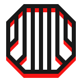

<div align='center'>
    <picture>
        <source media='(prefers-color-scheme: dark)' srcset='./.github/pneumatics-logo-light-160.png' />
        <source media='(prefers-color-scheme: light)' srcset='./.github/pneumatics-logo-dark-160.png' />
        
    </picture>
    <h1>⬡ Pneumatics</h1>
</div>


[](https://bundlephobia.com/result?p=@pneumatics/pneumatics)
[](license.md)
[](https://www.npmjs.com/package/panopticon-core)
[](https://github.com/unordinarity/malotru)

File-driven headless CMS

# ⬡ Motivation/Promise

Pneumatics API works/feels like any other headless CMS, but doesn't force/lead you to install bloated packages and work/seek in bloated interfaces. Just plain files.

# ⬡ Features

# ⬡ Installation

```shell
npm i @pneumatics/pneumatics
```

```shell
yarn add @pneumatics/pneumatics
```

```shell
pnpm add @pneumatics/pneumatics
```

# ⬡ Usage/Utilizing/Enjoyment

```typescript

```

# ⬡ API

To use Pneumatics as JS packages, check [@pneumatics/pneumatics docs](./packages/pneumatics/readme.md)

# ⬡ Contribution

Feel free to open an issue/discussion with request/report, but ensure you read/follow [Contributor Covenant Code of Conduct](code_of_conduct.md)

# ⬡ Development/History

[Changelog/Past/Versions](changelog.md)

[Roadmap/Future](roadmap.md)

# ⬡ Legal info

Project licensed under [MIT License](license.md). [What it means](https://choosealicense.com/licenses/mit/)

# ⬡ Brand/Look

Project name, logo, visual design and writing style heavily inspired by [Control game](https://www.remedygames.com/games/control/) (made by [Remedy Entertainment](https://www.remedygames.com/))
